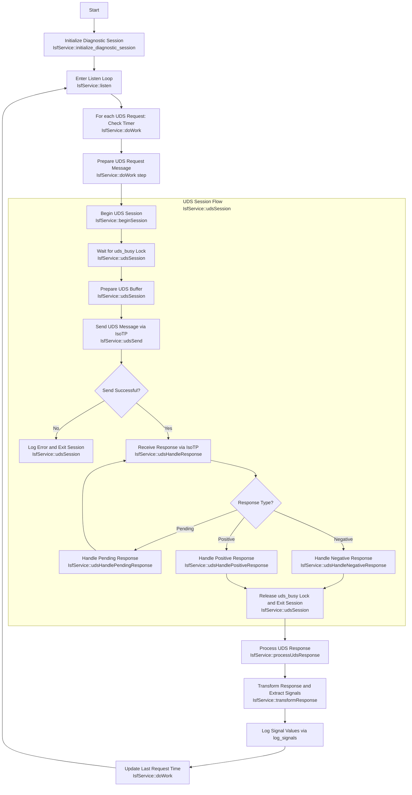

```mermaid
flowchart TD
    A[Start] --> B[Initialize Diagnostic Session
IsfService::initialize_diagnostic_session]
    B --> C[Enter Listen Loop
IsfService::listen]
    C --> D[For each UDS Request: Check Timer
IsfService::doWork]
    D --> E[Prepare UDS Request Message
IsfService::doWork step]
    E --> F[Begin UDS Session
IsfService::beginSession]

    subgraph UDS_Session [UDS Session Flow
IsfService::udsSession]
        F --> G[Wait for uds_busy Lock
IsfService::udsSession]
        G --> H[Prepare UDS Buffer
IsfService::udsSession]
        H --> I[Send UDS Message via IsoTP
IsfService::udsSend]
        I --> J{Send Successful?}
        J -- No --> K[Log Error and Exit Session
IsfService::udsSession]
        J -- Yes --> L[Receive Response via IsoTP
IsfService::udsHandleResponse]
        L --> M{Response Type?}
        M -- Pending --> N[Handle Pending Response
IsfService::udsHandlePendingResponse]
        N --> L
        M -- Negative --> O[Handle Negative Response
IsfService::udsHandleNegativeResponse]
        M -- Positive --> P[Handle Positive Response
IsfService::udsHandlePositiveResponse]
        O --> Q[Release uds_busy Lock and Exit Session
IsfService::udsSession]
        P --> Q
    end

    Q --> R[Process UDS Response
IsfService::processUdsResponse]
    R --> S[Transform Response and Extract Signals
IsfService::transformResponse]
    S --> T[Log Signal Values via log_signals]
    T --> U[Update Last Request Time
IsfService::doWork]
    U --> C

```